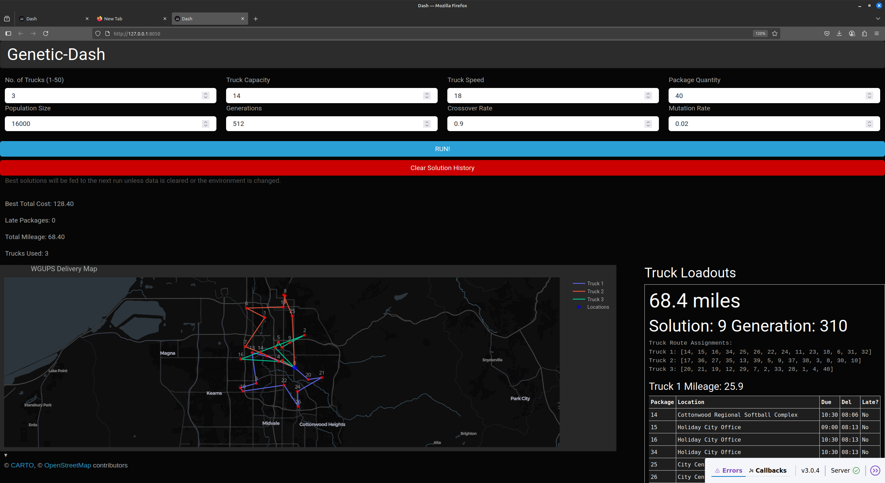
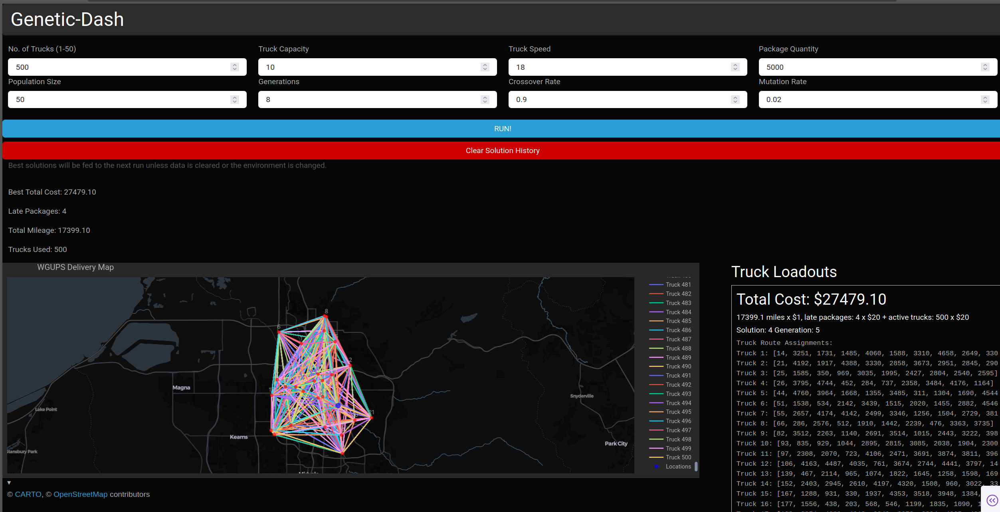

# Genetic Dash – Delivery Route Optimization using a Genetic Algorithm

[](https://genetic-dash.com)
[](LICENSE)
[]()
[]()
[](https://github.com/RichardGSchmidt/genetic-dash/actions)





---

## Overview

Genetic Dash is a web-based interactive dashboard that visualizes the evolution of optimized delivery routes using a genetic algorithm.

- Real-time package delivery routing simulation
- Genetic algorithm with crossover, mutation, and elite preservation
- Fully interactive map and control panel built with Dash (Plotly)
- Hosted at [genetic-dash.com](https://genetic-dash.com)

---

## Features

- Dynamic routing with time, deadlines, and delivery constraints
- Live visualization of each generation’s performance
- Custom package editor and random scenario generation
- Truck-level stats, mileage, and deadline analytics
- GA tuning (population size, mutation rate, etc.)

---

## Tech Stack

| Component        | Technology       |
|------------------|------------------|
| Frontend         | Dash (Plotly), Bootstrap components |
| Backend          | Python 3.10, Flask |
| Optimization     | Custom Genetic Algorithm |
| Hosting          | **Raspberry Pi 4** + Docker + Cloudflared Tunnel |
| Deployment       | Live @ [genetic-dash.com](https://genetic-dash.com) |

> Running on a Raspberry Pi demonstrates efficient resource use and practical deployment skills on low-power hardware.

---

## Getting Started

```bash
git clone https://github.com/YourUser/genetic-dash.git
cd genetic-dash
pip install -r requirements.txt
python genetic-dash.py
```

Or via Docker:

```bash
docker build -t genetic-dash .
docker run -p 8050:8050 genetic-dash
```

---

## Genetic Algorithm Highlights

- Genome encodes truck-package assignments
- Fitness function balances deadline adherence and mileage
- Cascade mutations intelligently shuffle truck loads
- Uses elitism and diversity-preserving strategies

---

## Screenshot


Running at enterprise scale on a raspberry pi.
---

## Purpose

This project demonstrates:
- Real-world AI in logistics
- Proficiency in Dash, Python, and optimization algorithms
- Full-stack skills including deployment and live hosting
- Raspberry Pi-based hosting as a demonstration of lean deployment
- Effective visualization of complex backend processes

---

## About the Author

Created by **Richard Schmidt**, U.S. Veteran and WGU Computer Science graduate, pursuing an M.S. in AI/ML.

Focused on practical AI for logistics, simulation, and optimization.

[LinkedIn](https://www.linkedin.com/in/richard-schmidt-328860138/) | [GitHub](https://github.com/RichardGSchmidt)

---

## License

This project is licensed under the MIT License. See the [LICENSE](LICENSE) file for details.

---

##️ Usage Guide

Once the app is running (either locally or at [genetic-dash.com](https://genetic-dash.com)):

- **Generate or Edit Packages**:  
  Use the controls in the top-right to add/edit delivery packages, or randomly generate them with control over time windows and deadlines.

- **Adjust Algorithm Parameters**:  
  Use sliders and input fields to change:
  - Population size
  - Number of generations
  - Mutation rate
  - Truck count and capacity

- **Run the Algorithm**:  
  Click “Run” to visualize delivery routes optimized across generations.

- **Interpret the Map**:  
  Each truck’s route is shown with waypoints and delivery locations. Hover for details.

- **Analyze Results**:  
  Below the map:
  - Tables display truck mileage, deliveries, and deadlines met/missed.
  - Generation-by-generation cost comparisons show GA progress.

- **Reset or Modify**:  
  Use the “Clear” or “Regenerate” buttons to start over or load a new scenario.