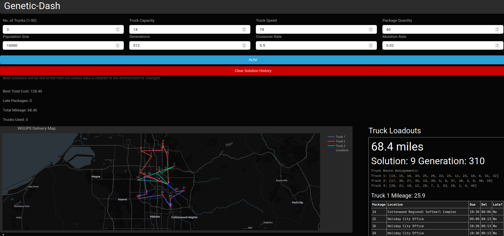

# Genetic Algorithm Dashboard

A Dash-based visualization dashboard for genetic algorithm results, showing cost breakdown and generation tracking.



## Requirements
The application expects:
- `Python 3.11.0+` - Required for libraries like plotly
- `./data/addresses.csv` - Contains Address metadata.
- `./data/distances.csv` - Distance matrix for routing calculations
- `./data/packages.csv` - Dummy package data for the first 40 packages, additional packages are generated on demand.
- `internet connection to MapLibre` - for Plotly to pull mapping data from MapLibre and open source GIS
## Features
- Uses a Genetic Algorithm to solve Route optimization
- Interactive Map Visualizations using MapLibre for open source mapping information
- Stacked line chart showing cost breakdown (late packages, mileage, trucks)
- Generation timeline bar chart showing improvement over generations

## Installation

1. Clone this repository (or download the zip, extract, and navigate to it in terminal):
```bash
git clone https://github.com/RichardGSchmidt/genetic-dash.git
cd genetic-dash
```

2. Create a virtual environment (recommended):
```bash
python3 -m venv venv
source venv/bin/activate  # On Windows: venv\Scripts\activate
```

3. Install dependencies:
```bash
pip install -r requirements.txt
```

# Usage

Run the dashboard:
```bash
python3 genetic-dash.py
```

The dashboard will be available at `http://127.0.0.1:8050/`

## Inputs
Click Run to generate optimized delivery solutions.  Use the inputs, sliders, and graphs to explore the problem and solutions.


### Environmental Inputs

Truck settings include: <b>No. of Trucks</b>, <b>Truck Capacity</b>, and <b>Truck Speed</b>.
By default, truck settings are the business use case explored in the project but can be changed to play around with the algorithm.

<b>Package Quantity</b> is a selectable number that will pull packages from the csv for packages 1-40 and will randomly generate any remaining packages requested.

<b>Refilling from depot is current disabled so the generator will abort on launch if you attempt to assign more packages than your trucks have the capacity to meet.</b>

The program scales up, although it will take much longer on more complicated problems.


Note: Changing anything in the environmental inputs will clear the solution history.

### Generator Inputs
The settings <b>Population Size</b> and <b>Generations</b> will increase odds of finding better solutions, at the cost of time.  
<b>Use caution when setting these</b>, as the settings are open enough that you can cause very long run times if you set both values high.  
If it's running on a free cloud asset or a raspberri pi, try to stay under 1000 population and 16 generations to avoid very long run times.

The best results from the previous run will be passed to the next run for the initial population until the user changes inputs or hits clear.
This means you can keep solution progress between runs as long as you don't change any variables that would invalidate the old solutions (you can change GA parameters, but not the trucks / packages).
So far the best solution I have found with the default data set is 68.4 miles in the current version by running the program for a very long time.

<b>Crossover</b> and <b>Mutation</b> are both bound between 1 and 0 and represent the probability that either will occur.  The sweet spots for these seem to be in the 0.8-0.9 range for cross over and around 0.05-0.01 for mutation.
Crossover is when two solutions "breed" with each other and produce offspring.
Mutation is when a solution has part of its own internal information swapped around randomly.

## Visualizations

After completing a run the following visualizations / tools will become available for use:

>1. Interactive Map view with color coded truck routes. (shown above) with a slider bar for exploring the different best solutions discovered through each run.
>3. Truck Loadout viewer. Used to validate data and display route information to the user. (shown above)
>4. Stacked Cost Line Graph.  Useful for tracking the progression of cost reduction. (shown below)
>5. Bar Chart showing the magnitude of cost improvement per generation.  Useful for analyzing for stagnation. (shown below)

